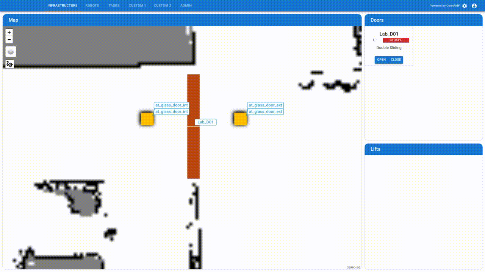

[](https://github.com/KABAM-Robotics/door_adapter_megazo/actions/workflows/industrial_ci_action.yml)
[](https://opensource.org/licenses/Apache-2.0)


## **What Is This?**

This repository contains the RMF Door Adapter that interfaces with Smarfid's Door Access System ICAD v3.



## **Dependencies** 📚

- ROS 2 `Humble`
- [Open-RMF on Humble Hawksbill - Sync 2023-12-29](https://github.com/open-rmf/rmf/releases/tag/release-humble-231229)
- [ICAD Integrated Access Control Device]()

## **Build** 🔨

```bash
cd $HOME
```

```bash
git clone https://github.com/KABAM-Robotics/door_adapter_megazo.git --depth 1 --single-branch --branch devel/humble && cd door_adapter_megazo
```

```bash
docker build -t door_adapter_megazo:humble .
```

## **Run** ⚙️

```bash
docker run -it --rm \
    --name door_adapter_megazo_c \
    --network host \
    -e RMW_IMPLEMENTATION=rmw_cyclonedds_cpp \
    -v ./door_adapter_megazo/config.yaml:/door_adapter_megazo_ws/src/door_adapter_megazo/config.yaml \
door_adapter_megazo:humble /bin/bash -c "source /ros_entrypoint.sh && ros2 run door_adapter_megazo door_adapter --config_file /door_adapter_megazo_ws/src/door_adapter_megazo/config.yaml"
```

## **Verify** ✅

Upon the running the command above, it should output similar to what is shown below:

```bash
[INFO] [1729654097.436618736] [door_adapter_megazo]: Initialising [door_adapter_megazo]...
[INFO] [1729654097.472651911] [door_adapter_megazo]: Connected to door client API.
[INFO] [1729654098.498656692] [door_adapter_megazo]: Door [Lab_D01] [MODE_CLOSED]
[INFO] [1729654099.511240654] [door_adapter_megazo]: Door [Lab_D01] [MODE_CLOSED]
[INFO] [1729654100.514910118] [door_adapter_megazo]: Door [Lab_D01] [MODE_CLOSED]
[INFO] [1729654101.502347821] [door_adapter_megazo]: Door [Lab_D01] [MODE_CLOSED]
```

## **Configure** 🔧

To allow `door_adapter_megazo` to be configured for custom deployment, please edit the following in `config.yaml`:

- door name and id 
> Set the same as the door on your RMF Map `.building.yaml` file.

- door_auto_closes
> Set to True if door remains closed until requested open, and automatically closes if it does not receive subsequent open requests.

- door_signal_period
> Set time taken for door signal to be effective, in seconds.

- continuous_status_polling
> Set whether to keep checking door state when there are no requests.

- header_key, header_value
> Set the Megazo API username and password respectively. Please contact the Megazo vendor for details.

- enable_mqtt_status_polling
> Set whether to poll a door status using MQTT or not. Use when conventional approach is inaccurate.

## **Contributions**

**We welcome contributions!** Please see the [contribution guidelines](/CONTRIBUTING.md).

## **References**

- https://osrf.github.io/ros2multirobotbook/integration_doors.html
- https://docs.python-requests.org/en/master/

## **Maintainer(s)**

- Bey Hao Yun (Gary)